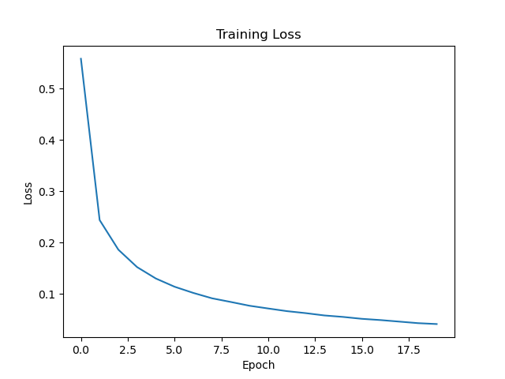

# Neural Network from Scratch (NumPy)

## Overview
Built a fully connected neural network from scratch using only NumPy to classify MNIST handwritten digits.

## Features
- Forward propagation
- Backpropagation
- ReLU activation
- Softmax output
- Cross-entropy loss

## Results
- Accuracy: ~91%

### Loss curve:

  

## Tech Stack
- Python
- NumPy
- Matplotlib

## Learnings
- Implemented gradient descent manually
- Understood chain rule in backpropagation